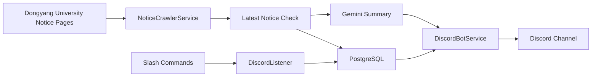

# <h1 align="center">NoticeBot</h1>

동양미래대학교 공지사항을 Discord로 전달하는 자동화 봇

  학교 전체공지와 학과 공지를 주기적으로 확인하고, 
  필요한 사용자에게 빠르게 전달하는 Discord 기반 알림 서비스입니다.

  

  
  
  
  
  

 

## 프로젝트 소개

대학교 공지사항은 학사 일정, 장학 안내, 신청 기간, 학과 행사처럼 놓치면 바로 불편으로 이어지는 정보가 많지만, 실제로는 게시판이 여러 군데로 나뉘어 있어 사용자가 직접 찾아봐야 하는 경우가 많습니다.

NoticeBot은 이런 불편을 줄이기 위해 만든 Discord 기반 공지 알림 봇입니다.  
학교 전체공지와 학과 공지를 주기적으로 확인하고, 새로운 공지가 올라오면 서버에 자동으로 전달합니다. 사용자는 관심 있는 학과만 골라 구독할 수 있고, 원하는 키워드를 등록해 필요한 공지만 더 빠르게 받아볼 수 있습니다.

긴 공지는 그대로 전달하는 대신 핵심 일정과 내용을 간단히 요약해 보여주도록 구성했습니다. 그래서 공지를 하나하나 열어보지 않아도 중요한 내용을 먼저 파악할 수 있습니다.

 

## 주요 기능

### 학교 전체공지 / 학과 공지 수집
- 학교 전체공지와 학과 공지 게시판을 분리해서 관리합니다.
- 새로운 공지를 감지하면 DB에 저장하고 Discord 채널로 전송합니다.
- 이미 확인한 공지는 다시 상세 페이지를 읽지 않도록 처리해 불필요한 요청을 줄였습니다.

### 구독 기반 알림
- 사용자는 특정 학과 공지만 선택적으로 구독할 수 있습니다.
- 학교 전체공지 수신 여부도 개인 단위로 설정할 수 있습니다.
- 서버별로 공지 채널과 알림 사용 여부를 따로 관리할 수 있습니다.

### 키워드 알림
- 관심 있는 키워드를 등록해두면 제목이나 본문에 해당 단어가 포함된 공지에 반응합니다.
- 장학금, 모집, 신청, 인턴십 같은 주제 중심으로 공지를 받아볼 수 있습니다.

### AI 요약
- 긴 공지 본문은 AI를 통해 핵심 일정과 내용을 짧게 정리합니다.
- 공지 링크를 열기 전에 먼저 중요 포인트를 확인할 수 있도록 구성했습니다.

### Discord 명령어 기반 사용
- 공지 조회, 구독 설정, 키워드 등록, 채널 설정을 모두 Discord 안에서 처리할 수 있습니다.
- 별도의 웹 페이지 없이 봇 명령어만으로 주요 기능을 사용할 수 있습니다.

 

## 어떻게 구현했는가

### 공지 수집 방식
공지 데이터는 별도의 공식 API가 아니라 실제 학교 공지 페이지 HTML을 읽는 방식으로 수집했습니다.  
`Jsoup`를 사용해 목록 페이지에서 최신 공지의 링크와 식별값을 추출하고, 새 공지일 때만 상세 페이지에 접근해 본문을 가져오도록 만들었습니다.

초기 구조는 일정 주기마다 전체 공지판을 한 번에 확인하는 방식이었지만, 현재는 공지판을 하나씩 순환하며 확인하는 구조로 바꾸어 순간적인 요청 집중을 줄였습니다. 또한 `lastSeenExternalId`를 저장해 이미 확인한 공지를 빠르게 건너뛸 수 있게 했습니다.

### Discord 봇 구성
봇 기능은 `JDA`를 사용해 구현했습니다.  
사용자는 Slash Command를 통해 최근 공지를 조회하거나, 특정 학과를 구독하거나, 키워드를 등록할 수 있습니다. 서버 관리자는 공지를 받을 채널과 알림 사용 여부를 설정할 수 있도록 했습니다.

### 데이터 저장 구조
공지 정보와 구독 정보는 `Spring Data JPA`와 `PostgreSQL`을 기반으로 관리합니다.

- `GlobalNoticeSource`, `Department`: 공지판 정보
- `Notice`: 수집된 공지 데이터
- `GuildSetting`: 서버별 설정
- `UserSetting`: 사용자별 전체공지 수신 설정
- `Subscription`: 학과 구독 정보
- `Keyword`: 키워드 알림 정보
- `Notification`: 이미 전송된 공지 이력

이 구조를 통해 새 공지 여부 확인, 중복 알림 방지, 서버별/사용자별 설정 분리를 처리했습니다.

### 요약 기능
공지 본문 요약은 `Gemini API`를 사용했습니다.  
긴 공지 내용을 그대로 보내는 대신 핵심 일정과 중요한 정보를 짧게 정리해서 전달하도록 구성했고, 새 공지일 때만 요약을 수행해 불필요한 호출을 줄였습니다.

### 운영 관점에서의 개선
봇 특성상 오래 켜져 있어야 하기 때문에 메모리 사용량과 요청 패턴도 함께 조정했습니다.

- 내장 웹 서버를 제거해 불필요한 런타임 오버헤드를 줄임
- Discord 봇 캐시를 가볍게 설정해 메모리 점유를 줄임
- 공지판을 순차적으로 확인하도록 바꿔 burst 부하를 완화
- 요청 타임아웃과 DB 커넥션 풀 크기를 조정해 서버 부담을 줄임

 

## 시스템 흐름

 

## 기술 스택

### Backend

### Bot / Crawling / AI

### Database / Infra

### Collaboration

